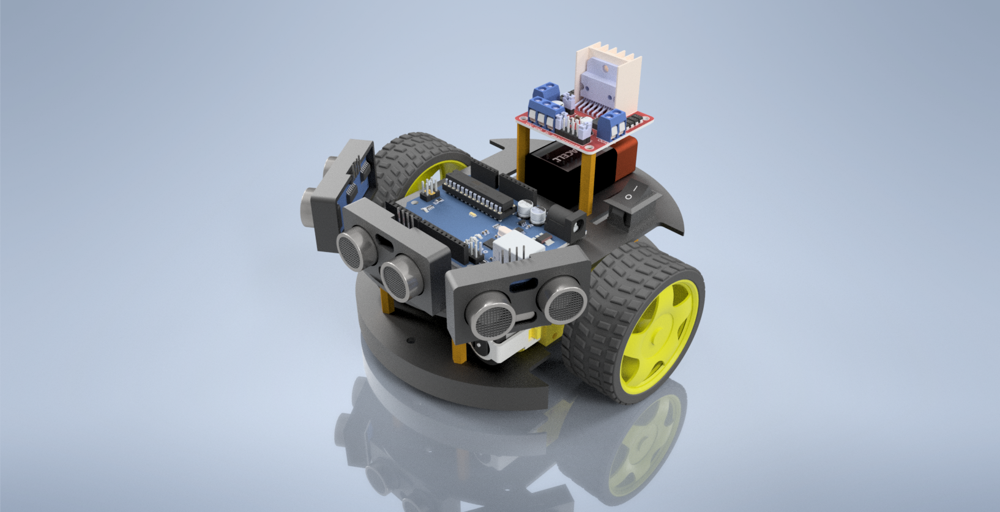

# Modelo 3D do carrinho

Neste diretório é possível encontrar o modelo 3D do carrinho, feito com o software de CAD Inventor, da Autodesk.

O arquivo [carrinho.iam](carrinho.iam) é o arquivo de montagem do Inventor, abaixo estão algumas representações do modelo feito.

